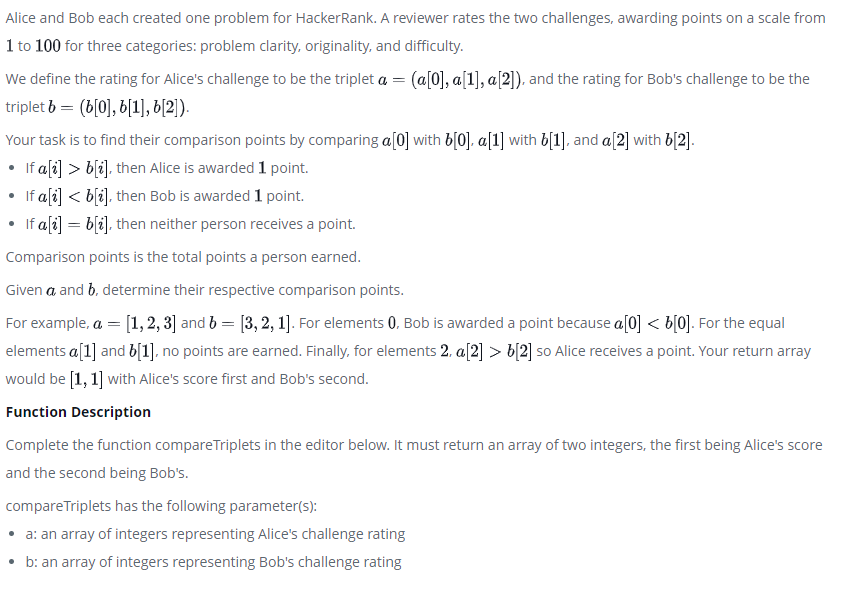

카카오 코딩 테스트를 계기로 알고리즘 공부를 시작했다.
개인적인 기록과 블로그 포스팅 겸 정리해서 올려보려고 한다.

# Compare the Triplets
https://www.hackerrank.com/challenges/compare-the-triplets/problem




# Input Format


# Output Result


# Dev Code

```Java
import java.io.*;
import java.math.*;
import java.security.*;
import java.text.*;
import java.util.*;
import java.util.concurrent.*;
import java.util.function.*;
import java.util.regex.*;
import java.util.stream.*;
import static java.util.stream.Collectors.joining;
import static java.util.stream.Collectors.toList;

public class Solution {

    // Complete the compareTriplets function below.
    static List<Integer> compareTriplets(List<Integer> a, List<Integer> b) {

        List<Integer> scoreResult = new ArrayList<Integer>();
        int aScore = 0, bScore = 0;

        if (a.size() == b.size()) {
            for (int i = 0; i < a.size(); i++) {
                if (a.get(i) > b.get(i)) {
                    aScore++;
                } else if (a.get(i) < b.get(i)) {
                    bScore++;
                }
            }
        }

        scoreResult.add(aScore);
        scoreResult.add(bScore);

        return scoreResult;
    }

    public static void main(String[] args) throws IOException {
        BufferedReader bufferedReader = new BufferedReader(new InputStreamReader(System.in));
        BufferedWriter bufferedWriter = new BufferedWriter(new FileWriter(System.getenv("OUTPUT_PATH")));

        List<Integer> a = Stream.of(bufferedReader.readLine().replaceAll("\\s+$", "").split(" "))
            .map(Integer::parseInt)
            .collect(toList());

        List<Integer> b = Stream.of(bufferedReader.readLine().replaceAll("\\s+$", "").split(" "))
            .map(Integer::parseInt)
            .collect(toList());

        List<Integer> result = compareTriplets(a, b);

        bufferedWriter.write(
            result.stream()
                .map(Object::toString)
                .collect(joining(" "))
            + "\n"
        );

        bufferedReader.close();
        bufferedWriter.close();
    }
}

```

# Conclusion
Java8에 대한 명확한 개념이 부족함을 느낀거같다.
Java8에 어떤 기능이 추가됬으며, 무엇이 강점인지 찾아봐야겠다.
