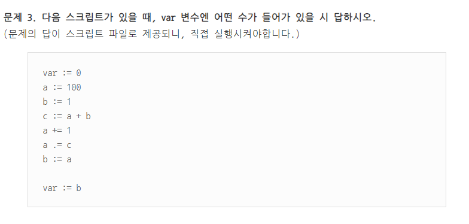

# Variable & Operator
### Variable
변수는 사전적 의미로는 바뀔 수 있는 수입니다.
오토핫키 및 다른 프로그래밍 언어에서도 마찬가지입니다. 변수 안의 수는 언제든지 바뀔 수 있습니다.

저는 조금 다르게 설명해보겠습니다.
변수는 수나 문자에 이름을 붙이는 것입니다. 아래와 같이 말입니다.

> 숫자 "36000"에 "가격"이라는 이름을 붙일 수 있습니다.
여기서 "가격"은 변수, "36000"은 값이라고 할 수 있습니다.

> 문장 "동해물과 백두산이 마르고 닳도록"에 "애국가"라는 이름을 붙일 수 있습니다.
"애국가"는 변수, "동해물과 백두산이 마르고 닳도록"은 값이 됩니다.

### Why Uss Variable
사실 굳이 써야할 이유를 못 느끼시는 분들이 많으실겁니다. 그렇지만 아래 글을 MsgBox로 출력하는 경우를 상상해봅시다.


그러던 어느날 김대감의 독자인 <b><i>김수한무 거북이와 두루미 삼천갑자 동방삭 치치카포 사리사리센타 워리워리 세브리깡 무두셀라 구름이 허리케인에 담벼락 담벼락에 서생원 서생원에 고양이 고양이엔 바둑이 바둑이는 돌돌이가</i></b> 우물에 빠지자 기겁한 하인이 김대감에게 "마님!! 글쎄 <b><i>김수한무 거북이와 두루미 삼천갑자 동방삭 치치카포 사리사리센타 워리워리 세브리깡 무두셀라 구름이 허리케인에 담벼락 담벼락에 서생원 서생원에 고양이 고양이엔 바둑이 바둑이는 돌돌이</i></b> 도련님이 우물에 빠졌어요!" 라고 보고했고, 대감도 크게 놀라 "아니 우리 오대 독자 <b><i>김수한무 거북이와 두루미 삼천갑자 동방삭 치치카포 사리사리센타 워리워리 세브리깡 무두셀라 구름이 허리케인에 담벼락 담벼락에 서생원 서생원에 고양이 고양이엔 바둑이 바둑이는 돌돌이가</i></b> 우물에 빠졌다고?

> 이는 다음과 같이 변수로 줄여서 써볼 수 있습니다. (김수한무 ~ 돌돌이를 name이라는 변수에 담았습니다.)

그러던 어느날 <b>name</b>가 우물에 빠지자 기겁한 하인이 김대감에게 "마님!! 글쎄 <b>name</b> 도련님이 우물에 빠졌어요!" 라고 보고했고, 대감도 크게 놀라 "아니 우리 오대 독자 <b>name</b> 가 우물에 빠졌다고?

---

훨씬 읽기 편해졌지요.

만약에 김수한무 ~ 돌돌이의 이름이 바뀌었다고 가정하면, 원래 글에서는 일일이 하나씩 문장을 다시 입력해주어야 했지만, 변수를 사용한 글에서는 name 변수의 값만 바꿔주면 세 군데 모두가 바뀐 효과를 낼 수 있습니다.

$e.i:$

```autohotkey
name := "김수한무 거북이와 두루미 삼천갑자 동방삭 치치카포 사리사리센타 워리워리 세브리깡 무두셀라 구름이 허리케인에 담벼락 담벼락에 서생원 서생원에 고양이 고양이엔 바둑이 바둑이는 돌돌이가"

MsgBox %name%
```


### Operator
연산자는 이름에서 알 수 있듯이, 연산자는 "연산"을 하기 위해 사용되는 문자입니다.
연산이라고 해서 숫자 계산만 생각하시면 안되고, 여러가지 용도로 사용됩니다.

연산자는 이럴 때 씁니다.

* 값을 변수에 대입할 때
* 값끼리 더하거나, 빼거나, 곱하거나, 나눌 때
* 값끼리 비교할 때
* 기타 등등

### 연산자 종류

* 대입 연산자: 변수의 값을 넣는 연산자(2가지 종류)
  + $:=$
    - 오른쪽에 있는 식을 왼쪽에 대입한다
    - ```autohotkey
      var1 := 10
      ```
    - ```autohotkey
      var2 := "신에게는 아직" var1 "척의 배가 남아있습니다"
      ```
  + $.=$
    - 뒤에 오는 값을 현재 가지고 있는 값에 '붙이는' 역할
    - ```autohotkey
      var3 := 1
      ```
    - ```autohotkey
      var3 .= var1
      ```
      > var4의 값은  3이 아닌, 초기값 10 + var1을 더한 13이다

* 산술 연산자: 값을 계산해주는 산술 연산자
  + ```autohotkey
    var := 2 + 3
    ```
  + 대입과 연산을 하나로 묶은 산술-대입 연산자
    - `+=`
    - `-=`
    - `*=`
    - `/=`
* 비교 연산자
  + `>`
  + `<`
  + `>=`
  + `<=`
  + `=`
  + `<>` : 다르다
* 논리 연산자
  + `&&`
  + `||`
  + `!`
* 증감 연산자
  + `++`
  + `--`

### 변수 응용 사용

```autohotkey

var := 100
MsgBox, %var% // 100 출력

;만약 변수가 많아 진다면?
MsgBox, %a% %b% %c% %d% %e% %f% %g% %h% %i% %j% ;스크립트가 너무 길어지고 관리가 어렵다

;그럴때를 위해 변수는 아래처럼 '%'를 한번만 쓸수 잇다.
MsgBox, % a b c d e f g h i j
;이 때, 변수와 변수 사이는 띄어쓰기로 구분해야하며,
;%와 첫 변수 사이도 무조건 띄워주어야 한다.

;에러1
MsgBox, % abcdefghij ;변수 abcdefghij를 출력한다.

;에러2
MsgBox, %a b c d e f g h i j ;오류로 인해 실행되지 않는다.(닫는 %가 없기 떄문에)

a := 1
b := 1
c := "귀요미"
MsgBox, % a " + " b " = " c
MsgBox, %a% + %b% = %c%
;위 2가지 방식을 혼용하면 에러

;에러3
MsgBox, %a% + %b% = % c "입니다." ;변수 %a% 방식과, % c 방식 혼용으로 에러
```


# Programming



